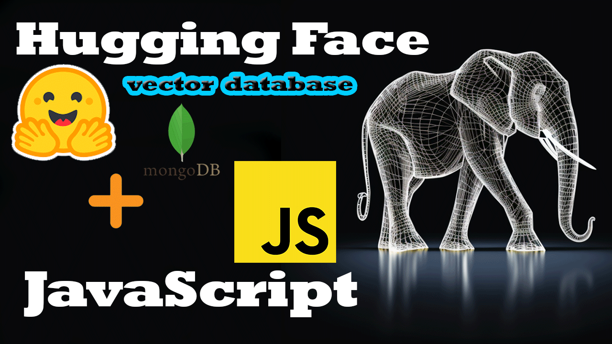

## Description

HuggingFace Models in Javascript: Using different tools, it is possible to use LLM models in Javascript projects, all locally

## Stack used
* Hugginface
* Nestjs
* MongoDB
* Python
* ONNX
* Transformerjs

<a href="#" target="_blank"></a>


## Installation

```bash
$ yarn install
```

## Env
```bash
copy .env.example and rename to .env
Set variables
```

## Running the app


```bash
# development
$ yarn run start

# watch mode
$ yarn run start:dev

# production mode
$ yarn run start:prod
```

## Endpoint
```json
http://localhost:3000/vectors
http://localhost:3000/vectors/search?word=red
```


## Documentation
* [MongoDB knn-vector](https://www.mongodb.com/docs/atlas/atlas-search/field-types/knn-vector/)
* [Transformerjs](https://huggingface.co/docs/transformers.js/index)
* [Tranformerjs Github](https://github.com/xenova/transformers.js)
* [ONNX](https://onnxruntime.ai/)

## Stay in touch

- Twitter/X - [@GeraDeluxer](https://twitter.com/GeraDeluxer)

## License

Nest is [MIT licensed](LICENSE).
